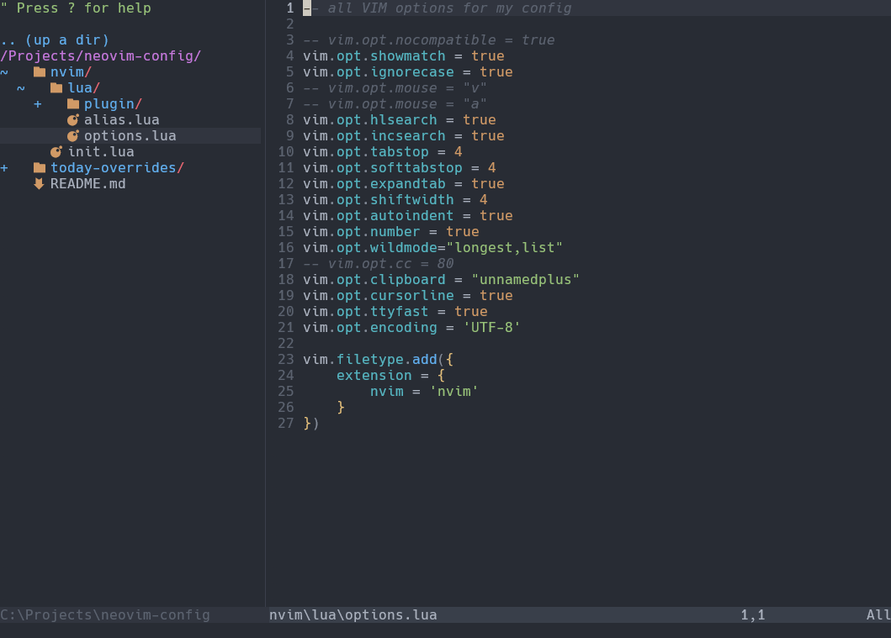

# NeoVim Config
This repository serves as a place to centralize the NeoVim config I use. It uses [`plug.vim`](https://github.com/junegunn/vim-plug) as the plugin manager, and uses lua as the initialization script.

I wrote this config from scratch, and there are still [issues to fix](https://github.com/evangipson/neovim-config/issues). My main goal of this config was to have a nice looking minimal NeoVim with a file tree and a C# [LSP](https://neovim.io/doc/user/lsp.html).

## Prerequisites
1. The latest version of [NeoVim](https://neovim.io/)
1. The latest version of [Microsoft.CodeAnalysis.LanguageServer](https://dev.azure.com/azure-public/vside/_artifacts/feed/vs-impl) that matches the target environment
1. This repository
1. A ["packed" nerd font](https://www.nerdfonts.com/font-downloads) of your choice, I use [Hack Nerd Font](https://github.com/ryanoasis/nerd-fonts/releases/download/v3.3.0/Hack.zip)
1. The terminal of your choice, I use [Windows Terminal](https://learn.microsoft.com/en-us/windows/terminal/)

## Install Process
1. Install the packed nerd font of your choice
1. Change the settings of your terminal to use the packed nerd font
1. Create a new folder: `%USERPROFILE%/AppData/Local/nvim-data/roslyn`
1. Unzip the contents of `Microsoft.CodeAnalysis.LanguageServer`
1. Place the contents of `/content/LanguageServer/<your-arch>/*` into the `%USERPROFILE%/AppData/Local/nvim-data/roslyn` directory
1. Place the `./nvim` folder from this repository into the `%USERPROFILE%/AppData/Local/` directory
1. Run `iwr -useb https://raw.githubusercontent.com/junegunn/vim-plug/master/plug.vim | ni `C:/Program Files/Neovim/share/nvim/runtime/autoload/vimfiles/autoload/plug.vim -Force` in your terminal
1. Open the terminal
1. Run `nvim`
1. Type `:PlugInstall` and hit enter
1. After the plugins install, type `:q!` to quit NeoVim
1. Copy the `today-overrides/lua/today` folder from this repository to the `%USERPROFILE%/AppData/Local/nvim-data/plugged/today.nvim/lua/today` directory
1. Copy the `today-overrides/plugin/today.lua` file from this repository and overwrite the `%USERPROFILE%/AppData/Local/nvim-data/plugged/today.nvim/plugin/today.lua` file
1. Copy the `today-overrides/lua/today/jrnl.md` file from this repository and place it in the `%USERPROFILE%\AppData\Local\nvim-data\plugged\today.nvim\lua\today` folder
1. Run `nvim` again to see the full config on display

## Plugins
- [NERDTree](https://github.com/preservim/nerdtree)
- [NERDTree Git Plugin](https://github.com/Xuyuanp/nerdtree-git-plugin)
- [Vim DevIcons](https://github.com/ryanoasis/vim-devicons)
- [OneDark](https://github.com/navarasu/onedark.nvim)
- [Roslyn LSP](https://github.com/seblj/roslyn.nvim)
- [Today](https://github.com/VVoruganti/today.nvim)
